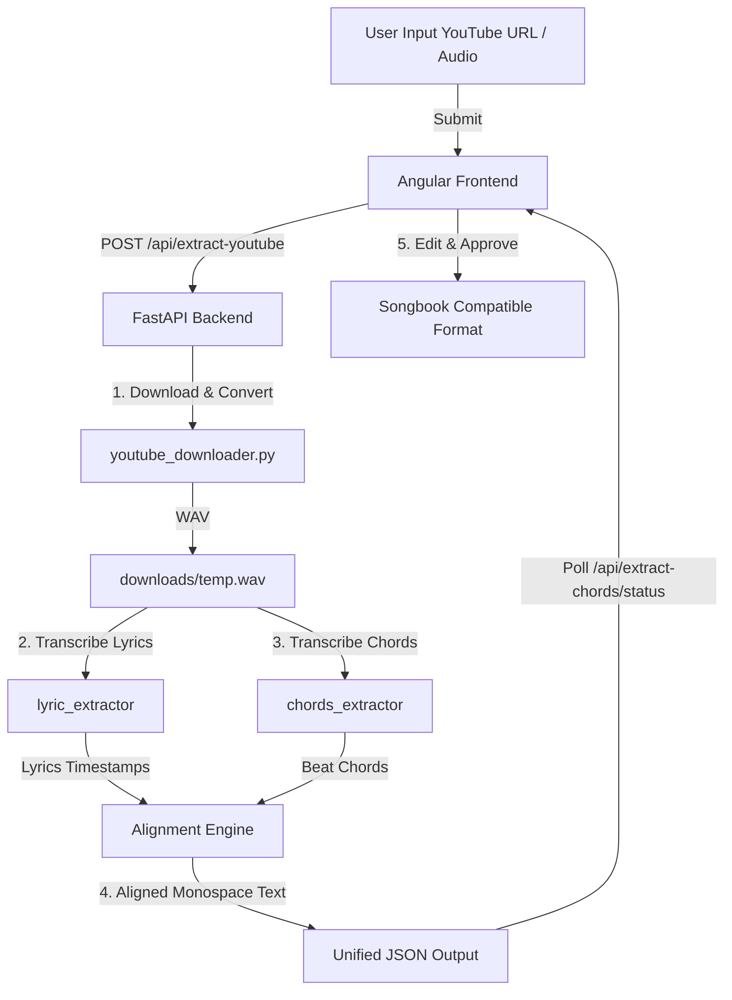

# Implementation Plan - Unified Audio to Songsheet Transcriber

We will integrate the frontend and backend components into a single project located in `c:\Develop\Github\audio_to_songsheet`. This project will transcribe chords and lyrics of English and Hebrew songs directly from a YouTube link or local audio file, aligning them into a songsheet compatible with the `songbook` format.

---

## User Review Required

> [!IMPORTANT]
> **Whisper Execution Performance**
> Running the OpenAI Whisper `base` model locally on a CPU may take 1-3 minutes per song depending on CPU speed. The backend will process this asynchronously using FastAPI `BackgroundTasks`, updating the frontend with progress percentage.
>
> **Python Dependency Management**
> We verified that the required libraries (`whisper`, `yt_dlp`, `madmom`, `librosa`, `soundfile`, `fastapi`, `uvicorn`, `requests`) are already installed in the user's Python 3.11 environment. We will still provide a unified `requirements.txt` for reproducibility.

> [!TIP]
> **Dynamic Language & Transcription Source Selection**
> We will add a selector to the frontend UI allowing the user to choose:
> - **Whisper (Auto-Detect)**
> - **Whisper (English)**
> - **Whisper (Hebrew)**
> - **YouTube Captions** (fast fallback, retrieves official timed captions from the YouTube API if they exist)

---

## Open Questions

There are no blocking open questions. We have verified that:
1. `madmom` works correctly under Python 3.11 when the collections/numpy monkeypatches are applied.
2. The `songbook` format uses Arial visual width calculations to render monospace space-aligned raw text. The space-aligned chordsheet produced by our alignment algorithm fits this format perfectly for both English (LTR) and Hebrew (RTL).

---

## Proposed Changes

We will copy the necessary components from the source directories, excluding temporary or bulky files (`node_modules`, `.angular`, `dist`, etc.), and write the unified integration code.

---

### Backend Components

We will build the backend inside `c:\Develop\Github\audio_to_songsheet\backend`.

#### [NEW] [requirements.txt](file:///c:/Develop/Github/audio_to_songsheet/backend/requirements.txt)
A unified Python dependency declaration.
- Includes `fastapi`, `uvicorn`, `requests`, `yt-dlp`, `librosa`, `soundfile`, `numpy`, `scipy`, `openai-whisper`, `madmom`, `youtube_transcript_api`, `jinja2`.

#### [NEW] [youtube_downloader.py](file:///c:/Develop/Github/audio_to_songsheet/backend/youtube_downloader.py)
Extracted and simplified from `C:\Develop\Github\youtube_to_wav\converter.py`.
- Exposes `ensure_ffmpeg()` to download and unpack FFmpeg to `./bin/` if missing.
- Exposes a helper `download_youtube_to_wav(url, output_dir)` which downloads the audio stream via `yt_dlp` and uses the local FFmpeg to write a 16-bit PCM WAV at 44.1kHz.

#### [NEW] [lyric_extractor](file:///c:/Develop/Github/audio_to_songsheet/backend/lyric_extractor)
Copied directory from `C:\Develop\Github\text_transcript\lyric_extractor\lyric_extractor`.
- [core.py](file:///c:/Develop/Github/audio_to_songsheet/backend/lyric_extractor/core.py): Exports the `LyricExtractor` class which loads the Whisper `base` model and transcribes resampled mono audio.

#### [NEW] [chords_extractor](file:///c:/Develop/Github/audio_to_songsheet/backend/chords_extractor)
Copied directory from `C:\Develop\Github\chords_transcript\chords_extractor`.
- Includes `extractor.py`, `cli.py`, and `essentia/bin/` (with all native DLLs and `streaming_extractor_music.exe`).
- We will add the required collection and numpy monkeypatches at the entry point of `extractor.py` to prevent import issues with Python 3.11.

#### [NEW] [app.py](file:///c:/Develop/Github/audio_to_songsheet/backend/app.py)
The primary FastAPI backend service.
- **Task Management**: Keeps a dictionary of background extraction tasks (`extraction_tasks`) updated by progress percent and status.
- **Endpoints**:
  - `POST /api/extract-youtube`: Takes a YouTube link and an optional `language` choice (which maps to whisper languages or "youtube_captions"). Starts background task.
  - `POST /api/extract-chords`: Takes a local audio path and optional `language`.
  - `GET /api/extract-chords/status/{task_id}`: Returns progress and result.
  - `POST /api/generate-chordsheet`: Performs the core line-alignment alignment using the Viterbi-decoded chords and Whisper lyrics segments.
  - `GET /api/select-file`: Opens a tkinter topmost file dialog to select audio files locally.
  - `GET /api/stream-audio`: Streams WAV audio to the frontend audio player.
- **Alignment & Sync Algorithm**:
  - Incorporates `generate_aligned_sheet_internal` to map chord changes onto lyric characters by calculating the ratio of time within the sung segment duration.

---

### Frontend Components

We will copy the Angular frontend from `C:\Develop\Github\old\Chords-and-Lyrics\frontend` to `c:\Develop\Github\audio_to_songsheet\frontend`.

#### [MODIFY] [app.component.html](file:///c:/Develop/Github/audio_to_songsheet/frontend/src/app/app.component.html)
- Add a dropdown list next to the YouTube link import button and local audio selector to allow selection of:
  1. Whisper (Auto-Detect)
  2. Whisper (English)
  3. Whisper (Hebrew)
  4. YouTube Captions (Only for YouTube links)
- Set up bidirectional binding to a new `transcriptionMode` variable.

#### [MODIFY] [app.component.ts](file:///c:/Develop/Github/audio_to_songsheet/frontend/src/app/app.component.ts)
- Define the `transcriptionMode` state variable (defaulting to `'auto'`).
- Pass the selected `transcriptionMode` parameter (as `language` or `source`) in the POST bodies of `handleSelectYoutube` and `startChordExtraction`.
- Ensure that the rendering layout adjusts appropriately based on the language of the output (RTL vs LTR).

#### [MODIFY] [api.service.ts](file:///c:/Develop/Github/audio_to_songsheet/frontend/src/app/services/api.service.ts)
- Update signatures of `extractChords` and `extractYoutube` to accept the `language` argument and include it in the POST body payload.

---

## Verification Plan

We will perform automated and manual verification to ensure correct execution.

### Automated Tests
1. **Model Import Test**: Run a python script to verify that `madmom` and `whisper` can be imported and initialized without errors.
2. **Chord Extraction Unit Test**: Run `chords_extractor/extractor.py` directly on a test file to verify Viterbi fusion works.
3. **Lyric Transcription Unit Test**: Run `lyric_extractor/run_extractor.py` directly to verify Whisper model transcribes successfully.

### Manual Verification
1. **Frontend Bootstrapping**:
   - Run `npm install` in the frontend directory to set up Angular.
   - Start the dev servers using `npm run start` and `python app.py` (or a unified `run.py` script).
2. **End-to-End Test (YouTube link)**:
   - Paste a YouTube URL (e.g., a short song in English/Hebrew).
   - Select Whisper (Hebrew) or Whisper (English).
   - Click "Import Link" and verify that progress updates from downloading, transcribing lyrics, transcribing chords, and aligning.
   - Verify that the resulting chordsheet is rendered with correct chords aligned above the correct characters.
3. **Songbook Integration Test**:
   - Verify that the final editor tab produces a raw text block that can be imported directly into `C:\Develop\Github\songbook` as a new song with the correct `isRTL` value.
